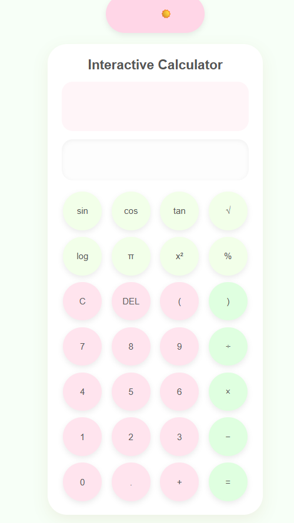
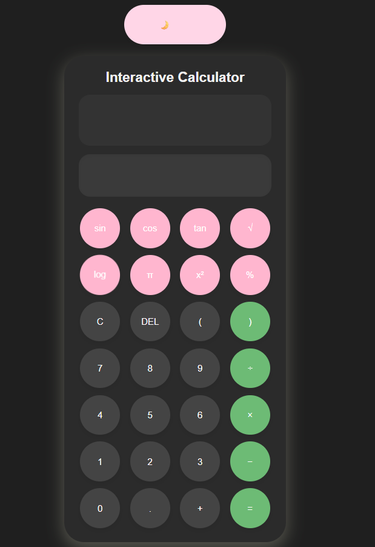

# 🌸 Interactive Scientific Calculator

A modern interactive calculator built using HTML, CSS, and JavaScript featuring scientific functions, keyboard support, calculation history, dynamic themes, and a soft pastel UI design.

---
## 🔗 Live Demo

👉 [View Live Project](https://prachibagasi.github.io/calculator/)

---

## ✨ Features

- Basic arithmetic operations
- Scientific calculations
  - sin()
  - cos()
  - tan()
  - square root
  - logarithms
  - π support
- Keyboard support
- Calculation history
- Light/Dark theme switcher
- Animated emoji theme toggle
- Responsive modern UI
- Circular pastel-themed buttons
- Smooth hover and transition effects

---

## 🛠️ Technologies Used

- HTML5
- CSS3
- JavaScript (Vanilla JS)

---

## 📂 Project Structure

```bash
calculator/
│
├── index.html
├── style.css
├── script.js
├── screenshots
│   └── light_theme.png
│   └── dark_theme.png
├── .gitignore
└── README.md
```

---

## 🚀 How to Run

### 1. Clone the repository

```bash
git clone https://github.com/your-username/interactive-calculator.git
```

### 2. Open the project folder

```bash
cd interactive-calculator
```

### 3. Run the project

Simply open `index.html` in your browser.

---

## ⌨️ Keyboard Shortcuts

| Key | Action |
|------|--------|
| 0-9 | Numbers |
| + - * / | Operators |
| Enter | Calculate |
| Backspace | Delete |
| Escape | Clear |

---

## 🎨 UI Highlights

- Soft pastel pink and green color palette
- Smooth dark/light mode transitions
- Circular floating buttons
- Animated emoji theme switcher
- Modern glassy shadows
- Minimal clean layout

---

## 📸 Preview


### main interface



---

## 📈 Future Improvements

- Replace `eval()` with a safer parser
- Add local storage for saved history
- Add sound effects
- Improve mobile responsiveness
- Add memory functions (M+, M-, MR)
- Add advanced scientific mode

---

## 🧠 What I Learned

Through this project, I practiced:

- DOM Manipulation
- Event Handling
- JavaScript Functions
- Keyboard Interaction
- Dynamic Theme Switching
- Responsive UI Design
- CSS Animations & Transitions
- Scientific Calculator Logic

---

## 👩‍💻 Author

Made with ❤️ by Prachi Bagasi